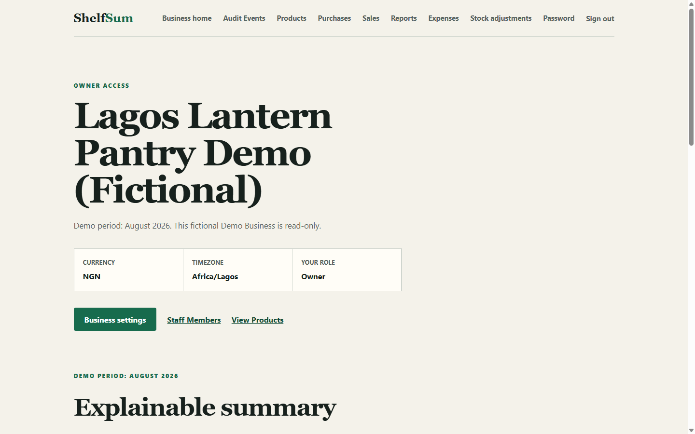
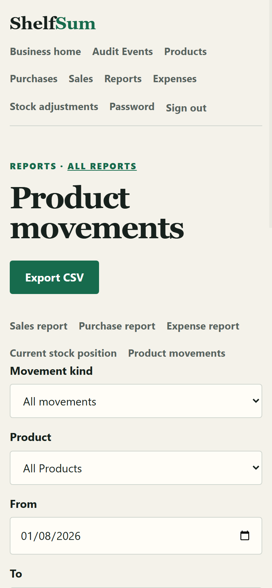

# ShelfSum

[](https://github.com/Lordt0m/shelfsum/actions/workflows/ci.yml)
[](https://shelfsum.onrender.com/)

ShelfSum is a server-rendered Django application for a small-shop Owner and Staff Member team to record stock and daily Business activity without losing the history behind the numbers.

It provides a Product catalogue, Purchases, Sales, Expenses, manual Stock Adjustments, explainable summaries, filtered reports, spreadsheet-safe CSV exports, and an append-only Audit Event browser. The application is designed as a focused operational record: it is not accounting software, and its profit figures are explicitly estimates derived from recorded activity.

## Why this project exists

A stock balance is only useful when a shop can explain how it changed. ShelfSum keeps a fast current Stock on Hand value while preserving an immutable Stock Movement for every opening quantity, Purchase, Sale, adjustment, and reversal.

The first release is aimed at one small Business with:

- an **Owner** who manages Business settings and Staff Members as well as daily records;
- **Staff Members** who can record and inspect day-to-day activity without owner-only controls; and
- visitors using a stable fictional **Demo Business** that is inspectable but cannot be changed.

## Demonstration access

The seeded Demo Business contains only fictional data. Both roles can inspect the dashboard, records, reports, CSV exports, Stock Movements, and Audit Events; server-side rules reject every attempted Demo write.

- **Public demonstration URL:** [https://shelfsum.onrender.com/](https://shelfsum.onrender.com/)
- Owner: `demo-owner@shelfsum.test` / `ShelfSumDemoOwner2026!`
- Staff Member: `demo-staff@shelfsum.test` / `ShelfSumDemoStaff2026!`

The Demo dashboard is fixed to August 2026 so its figures remain stable. Ordinary Businesses use the current calendar month in `Africa/Lagos`.

### Interface

| Desktop Operational Dashboard | Mobile Movements Report |
| :---: | :---: |
|  |  |

## What the application demonstrates

### Access and isolation

- Email-based registration and authentication with case-insensitive unique email addresses.
- One active Business membership per user and one Owner per Business.
- Owner-only Staff management and Business settings, enforced on the server.
- Business-scoped object resolution before record lookup, including filter choices and exports.
- Immediate access removal for inactive memberships without deleting historical actor attribution.
- A shared Demo Business rule at both request and service boundaries.

### Stock and transaction integrity

- Whole-number quantities and decimal monetary values.
- Current Stock on Hand reconciled with immutable Stock Movements.
- Atomic multi-line Purchase and Sale completion with deterministic Product locking.
- Sale availability rechecks and completion-time unit-cost snapshots.
- Completed documents protected from edits, deletion, bulk mutation, line insertion, and replay.
- One-time Purchase and Sale correction through exact reversal movements rather than destructive edits.
- Manual Stock Adjustments with a preview followed by a locked non-negative stock recheck.
- Consequential changes and their Audit Events committed or rolled back together.

### Explainable reporting

- A current-month dashboard for revenue, estimated cost of goods sold, Expenses, Estimated Profit, current stock value, low-stock count, and recent activity.
- Sales, Purchase, Expense, current stock-position, and Product-movement reports.
- Inclusive `Africa/Lagos` date filtering and Business-scoped Product, actor, action, status, and stock filters.
- HTML and CSV parity: an export uses the same validated result as the page.
- UTF-8 CSV output with formula-leading text neutralized before spreadsheet use.
- An immutable, newest-first Audit Event browser that retains deactivated actors.

Core forms are usable without JavaScript. JavaScript is progressive enhancement, not a runtime dependency, and the application does not require an AI model or paid API.

## Architecture

ShelfSum is one deployable Django monolith with explicit modules and small application-service seams:

| Module | Responsibility |
| --- | --- |
| `accounts` | Email-based user identity and authentication. |
| `businesses` | Business membership, access establishment, Owner controls, Demo write protection, and dashboard composition. |
| `catalogue` | Products, catalogue queries, forms, and Product-creation orchestration. |
| `inventory` | Stock Adjustments, immutable Stock Movements, locking, reconciliation, and stock changes. |
| `purchases` | Draft Purchase entry plus atomic completion and reversal. |
| `sales` | Draft Sale entry plus availability-safe completion, cost snapshots, and reversal. |
| `expenses` | Immutable Expense recording and void-and-replace correction. |
| `auditing` | Append-only Audit Events and the read-only Audit Event browser. |
| `reports` | Business-scoped report queries and shared HTML/CSV presentation rules. |

Views handle HTTP concerns and resolve records inside the active Business. Public services own multi-record transactions. Models and database constraints defend terminal records and immutable history against direct or bulk mutation. This keeps the request path easy to trace while making transaction rollback and invariant tests precise.

The accepted design decisions are recorded in [`docs/adr/`](docs/adr/), and the module contracts and invariant owners are mapped in [`docs/agents/module-map.md`](docs/agents/module-map.md).

## Data model

The main relationships are:

- `User` -> one `Membership` -> one `Business`.
- `Business` -> many `Products`, members, documents, Stock Movements, and Audit Events.
- `Purchase` / `Sale` -> many immutable terminal lines after completion.
- `Product` -> current Stock on Hand plus many immutable Stock Movements.
- `Stock Movement` -> exactly one valid origin: Stock Adjustment, Purchase line, Sale line, or reversed movement.
- `Expense` -> an immutable recorded or voided entry, optionally linked to a replacement.
- `Audit Event` -> Business, actor, action, affected record identity, summary, and timestamp.

Database constraints reinforce one-owner membership, unique Business-local Product identity, nonzero movement quantities, valid movement provenance, and one-time reversal links. Model and queryset guards protect immutable and terminal records, while application services add permission, locking, and cross-record validation that cannot be expressed by a single constraint.

## Important request flows

### Complete a Sale

1. Establish the authenticated active membership and current Business.
2. Resolve the draft Sale and its Products inside that Business.
3. Reject inactive actors, Demo writes, invalid lines, or terminal records.
4. Lock the Sale, ordered lines, and Products in one transaction.
5. Recheck availability, snapshot unit costs, reduce Stock on Hand, and write one Sale-origin movement per line.
6. Mark the Sale completed and append its Audit Event.
7. Roll back the complete operation if any downstream write fails.

### Correct a completed Purchase or Sale

The original document and movements remain unchanged. A one-time void operation locks the relevant records, validates the resulting stock, appends exact inverse Stock Movements, changes the document to `VOIDED`, and records an Audit Event atomically.

### Build a report

A protected view establishes the Business, validates filters, and calls one read-only report builder. The same result object supplies page rows, totals, and CSV output, preventing export drift.

## Permissions

| Capability | Owner | Staff Member | Demo Owner | Demo Staff |
| --- | :---: | :---: | :---: | :---: |
| Inspect Business records, reports, CSV, and Audit Events | Yes | Yes | Yes | Yes |
| Record Products, stock activity, Purchases, Sales, and Expenses | Yes | Yes | No | No |
| Change Business settings | Yes | No | No | No |
| Add or deactivate Staff Members | Yes | No | No | No |
| Change password through the shared Demo accounts | N/A | N/A | No | No |

Permission and isolation checks run on the server. Hiding a link in the interface is never the security boundary.

## Local setup

Requirements: Python 3.13 and Git. SQLite is the default local database, so PostgreSQL is not needed for the fast development loop.

### Windows PowerShell

```powershell
py -3.13 -m venv .venv
.\.venv\Scripts\python -m pip install -r requirements.txt
.\.venv\Scripts\python manage.py migrate
.\.venv\Scripts\python manage.py seed_demo
.\.venv\Scripts\python manage.py runserver
```

Open `http://127.0.0.1:8000/`. The health endpoint is `http://127.0.0.1:8000/health/`.

The seed command is deterministic: it creates the canonical fictional Business on the first run, and on rerun verifies and preserves the canonical fictional dataset without duplicating records while intentionally resetting the two published Demo passwords to their canonical values. It refuses partial or drifted canonical data rather than silently overwriting it.

## Testing

### Fast local suite

```powershell
.\.venv\Scripts\python manage.py check
.\.venv\Scripts\python manage.py makemigrations --check --dry-run
.\.venv\Scripts\python manage.py test
```

SQLite runs the complete portable suite. Three row-locking and independent-connection concurrency tests are explicitly PostgreSQL-only and therefore skip locally.

### PostgreSQL release suite

The GitHub Actions workflow in [`.github/workflows/ci.yml`](.github/workflows/ci.yml) provisions PostgreSQL 17 and uses an explicit CI-only settings mode. It:

1. confirms Django is using PostgreSQL;
2. runs system and migration-drift checks;
3. applies every migration to a clean service database;
4. runs the Demo seed twice to prove repeatability;
5. runs the complete test suite with a runner that converts any skip into a failure; and
6. checks production static collection and Django deployment settings.

Tests cover request behavior, role permissions, cross-Business isolation, direct-service denial, invalid input, immutable history, stock reconciliation, replay protection, transaction rollback, report/export parity, time boundaries, Demo state fingerprints, and PostgreSQL concurrency.

The workflow file is validated on GitHub Actions against PostgreSQL 17, asserting zero test skips and passing deployment checks on every proposed change.

## Deployment

The reviewed free-release path is:

- a Render web service in Frankfurt;
- a Neon PostgreSQL database in Frankfurt;
- Gunicorn for the Django application;
- WhiteNoise compressed manifest storage for static assets; and
- Render-provided HTTPS with restricted hosts, trusted origins, secure cookies, proxy handling, and HSTS.

Production requires `SHELFSUM_ENV=production`, a strong environment-held `SECRET_KEY`, a structurally valid SSL PostgreSQL `DATABASE_URL`, and an allowed hostname. Configuration fails closed when production signals are present without the production environment or required values.

[`render.yaml`](render.yaml) defines the service, health check, build command, start command, and non-secret environment contract. [`build.sh`](build.sh) installs pinned dependencies, collects static files, migrates the database, and seeds the Demo Business. Production secrets and connection strings are not committed or printed in release logs; the fictional shared Demo credentials are public by design.

The deployment is verified against hosted PostgreSQL CI, clean migration and deterministic August 2026 seeding, restart persistence, and dual-role access verification, with live responsive layout repairs across mobile, tablet, and desktop viewports currently undergoing verification.

## Trade-offs

- **Server-rendered monolith:** keeps permission and transaction behavior visible and lightweight, but does not demonstrate a separate API/client architecture.
- **Current balance plus immutable ledger:** makes stock fast to read and independently explainable, at the cost of maintaining a strict reconciliation invariant.
- **Explicit services instead of model signals:** makes ordering and rollback testable, but creates more small interfaces that must be documented.
- **Reversals instead of edits:** preserves provenance and correction history, but makes correction workflows more deliberate.
- **Completion-time cost snapshots:** keep historical Sale estimates stable when Product cost changes, but do not provide accounting valuation methods such as FIFO or weighted-average history.
- **SQLite locally, PostgreSQL for release:** keeps the Windows development loop light while reserving row-locking claims for the production database.
- **Manual entry first:** keeps the product usable without fragile external services, but excludes automatic catalogue, banking, payment, and exchange-rate integrations.

## Explicit exclusions

The first release does not include payments, invoicing, payroll, tax accounting, multicurrency, fractional quantities, multiple Businesses per user, forecasting, barcodes, external catalogue integrations, a REST API, or AI-dependent behavior.

## Known limitations

- Estimated Profit is an operational estimate, not accounting, tax, or cash profit.
- Current stock value uses the Product's current unit-cost estimate; it does not reconstruct historical inventory value.
- One user can belong to only one Business in the first release.
- Quantities are whole numbers and Business currency/timezone are fixed to `NGN` and `Africa/Lagos`.
- The free Render service may sleep while idle, so the first request after inactivity can be slower.
- Shared Demo credentials are public by design and protect fictional read-only data only.
- Public URL, CI badge, screenshots, restart persistence, and responsive layouts across mobile, tablet, and desktop viewports are verified against the live Render deployment.

## Repository evidence

- Product language: [`CONTEXT.md`](CONTEXT.md)
- Implementation specification: [`.scratch/finance-inventory/spec.md`](.scratch/finance-inventory/spec.md)
- Vertical tickets and completion records: [`.scratch/finance-inventory/issues/`](.scratch/finance-inventory/issues/)
- Architecture decisions: [`docs/adr/`](docs/adr/)
- Invariants and module interfaces: [`docs/agents/module-map.md`](docs/agents/module-map.md)
- Repository workflow and release gates: [`AGENTS.md`](AGENTS.md)
